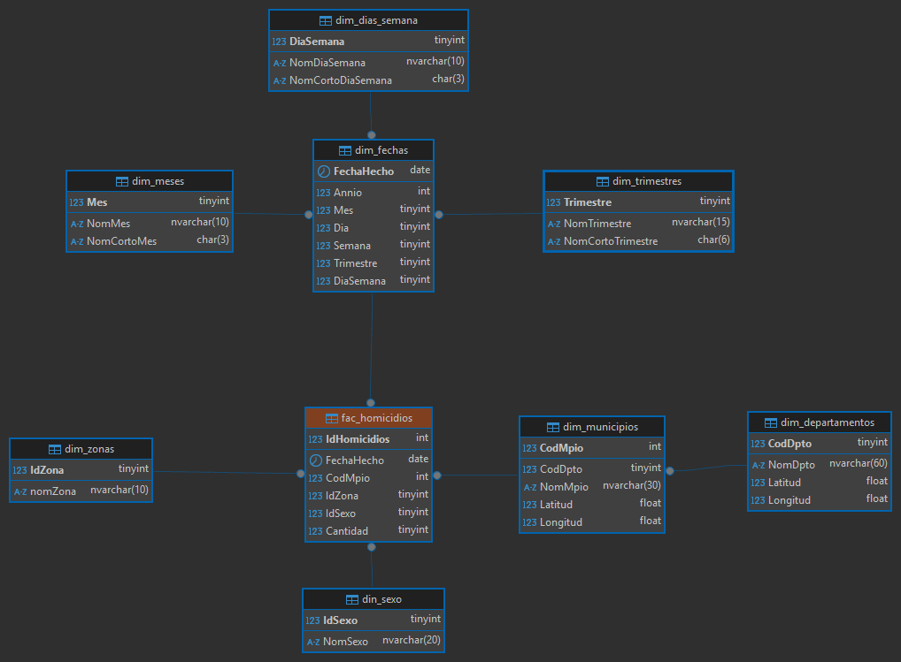

## Scripts

Contiene los scripts SQL para la creación de las tablas que almacenarán los datos extraídos, transformados y cargados desde el Data Lake.

- **dw_dim_departamentos_create**: Script SQL con la instrucción `CREATE TABLE` que define la estructura de la tabla de dimensión de Departamentos, basada en los datos transformados del archivo `dl_departamentos.csv`.
- **dw_dim_municipios_create**: Script SQL con la instrucción `CREATE TABLE` que define la estructura de la tabla de dimensión de Municipios, basada en los datos transformados del archivo `dl_municipios.csv`.
- **dw_dim_tiempo_create**: Script SQL con la instrucción `CREATE TABLE` que define la estructura de la tabla de dimensión de Tiempo, generada a partir de las fechas presentes en los datos de homicidios.
- **dw_hechos_homicidios_create**: Script SQL con la instrucción `CREATE TABLE` que define la estructura de la tabla de hechos de Homicidios, basada en los datos transformados del archivo `dl_homicidios.csv`.

## Modelo ER

El Data Warehouse utiliza un esquema en **copo de nieve** para modelar los datos, con tablas de dimensiones y una tabla de hechos. A continuación, se describe el modelo Entidad-Relación:

- **Dimensión Departamentos (dw_dim_departamentos)**: Almacena los códigos y nombres de los departamentos de Colombia. Clave primaria: `id_departamento`.
- **Dimensión Municipios (dw_dim_municipios)**: Almacena los códigos y nombres de los municipios, relacionados con los departamentos. Clave primaria: `id_municipio`. Clave foránea: `id_departamento` (referencia a `dw_dim_departamentos`).
- **Dimensión Tiempo (dw_dim_tiempo)**: Almacena atributos temporales (año, mes, día, etc.) derivados de las fechas de los homicidios. Clave primaria: `id_tiempo`.
- **Hechos Homicidios (dw_hechos_homicidios)**: Tabla de hechos que registra los homicidios, con métricas como el número de víctimas. Incluye claves foráneas: `id_departamento` (referencia a `dw_dim_departamentos`), `id_municipio` (referencia a `dw_dim_municipios`) y `id_tiempo` (referencia a `dw_dim_tiempo`). Clave primaria: `id_homicidio`.

El esquema en copo de nieve normaliza las dimensiones, permitiendo una relación jerárquica entre Departamentos y Municipios, optimizando el almacenamiento y facilitando análisis multidimensionales.

